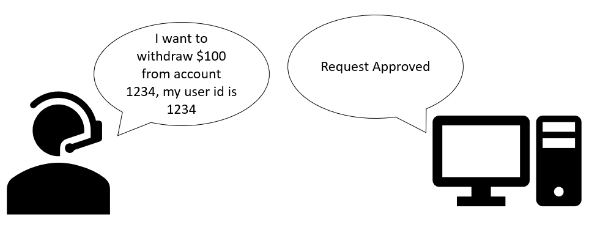

Recently, I have been very much involved in doing some (minimal) bug hunting and discovering vulnerabilities. And man, the amount of IDORs that I've found on some of these platforms in quite insane!

So, if youre a business owner and do not want to be leaking your customer's/client's data (And falling prey to PDPA/GDPR etc.), continue reading on :-)

<!--more-->

## Introduction to IDORs

Quoting [Portswigger](https://portswigger.net/web-security/access-control/idor), IDOR or Indirect Object References is a type of access control vulnerability that arises whan an application application uses user-supplied input to access objects directly, without a proper access control mechanism in place.

In short, IDORs arise due to missing or insufficient access control mechanism that allows other client's/customer's data to be accessed. Of course, the impact is not just confined to data leakage, there could also be exposure of sensitive or confidential information such as secret keys etc.

## How do IDORs work?




This is a perfect illustration of how IDORs actually work. In this scenario, a user with a user id of `1234` changes his user id to `123467`, but yet he is still able to withdraw money from his bank account due to a lack of proper validation of the user's identity. 

In this case, an IDOR vulnerability has been exploited as the servers did not verify the identity of the user. Of course, this is just a simple illustration. IDORs in real-life are much much much more complicated!

## Hunting for IDORs in applications

The most common way to find IDORs is to modify the URLs of the site that you are visiting. Take for instance, you are redirected to the URL **https://vulnerable-site.com?id=1234** , you could easily modify the id parameter to `123456` and if there is a lack of proper access control mechanism, you could easily access the webpage belonging to a user with an id of `123456`. This could potentially be scripted to allow us to gain access to a vast number of accounts!

Another more common way of exploiting IDOR vulnerability is to modify the JSON parameters. Take for example, the following JSON parameters that are going to be sent to the backend servers:
```bash
{id:1234,amount_transferred:300}
```
By modifying the `id` parameter, we could easily change account that we are going to send to the backend for processing, and without the proper access contorl mechanism in place, the money will be transferred to other accounts without the knowledge of the users. 

## How do we prevent IDORs?

So, I've said so much about IDORs, how do we actually prevent IDORs? The answer should be pretty obvious by now, its all abount ACCESS CONTROL!!!

1. Validation of user access. Any user that is accessed webpages, endpoints etc. should be properly validated and have their permissions properly checked to ensure that they have the appropriate permissions before they are granted access to the resources.

2. Indirect reference maps. Such maps replace the actual references used in URLs. So, instead of **https://vulnerable-site?id=1234** , we now use **https://vulnerable-site/a/c/d** to access the endpoint. This makes it more difficult for anyone to guess the mapping and reduces the risk of an IDOR vulnerability.
