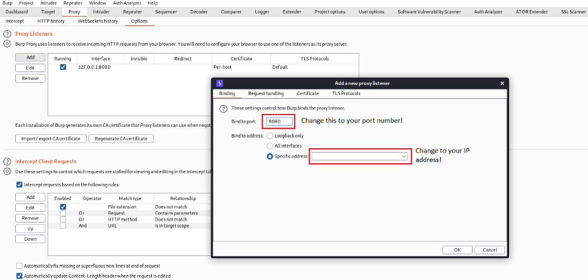

Ever since the changes to the trusted certificate authority to Android Nougat, android applications that target API level 24 and above no longer trust user or admin-added CAs for secure connections. This has brought a lot of headaches for many of us doing mobile pentesting as we are now unable to decrypt the SSL/TLS traffic and intercept the HTTPS requests using Burp suite by just downloading the CA certificate.

To go round this, there are essentially 2 ways we can do it:
1. Modify the APK file and recompile the APK file to allow proxy connections
2. Install the CA certificate as a system/root certificate in your android device

Today, I am going to give a short introduction about how to install CA certificate as a system/root certificate in your android device

<!--more-->

## Pre-requisites
1. Rooted device/emulator
2. ADB
3. CA certificate

In the examples shown below, I will be demonstrating how to intercept traffic using Burp Suite as an example and also, I will be using GenyMotion as my emulator (NOTE: You do not need to download ADB if you have Genymotion emulator as ADB is installed when you used Genymotion)

## Setting up Burp Suite

Firstly, we will have to set up the proxy to intercept the traffic from our Genymotion emulator. However, the proxy on Burp Suite runs on 127.0.0.1 by default so we will have to modify the IP address that we want to proxy the network traffic to. 



Next, we will have to download the CA certificate from Burp Suite. Using the downloaded CA certificate, we will convert the CA certificate to PEM format and output the new hash of the CA certificate.

```
openssl x509 -inform DER -in cacert.der -out cacert.pem
openssl x509 -inform PEM -subject_hash_old -in cacert.pem |head -1
```

Lastly, all we have to do is to rename the CA certificate

```
mv cacert.pem <hash>.0
```

## Setting up Android emulator

Firstly, we have to copy the CA certificate to Android as a system-level credential using ADB.
* If you are usign Genymotion, ABD is installed by default and the path to ADB can be found [here](https://docs.genymotion.com/desktop/latest/02_Application.html#use-third-party-adb-sdk)
* If not, you will have to install ADB from [Android SDK platform tools](https://developer.android.com/studio/releases/platform-tools)

```