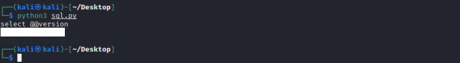

A tale of how improper access control and SQL Injection leaked out PIIs. 
For starters, many may be wondering "SQL Injection?! Is this for real?" The answer to that is Yes, you have read it correctly it is SQL Injection. SQL Injection has been an age-old vulnerability that has existed for an extremely long time but yet, time and again SQL Injection has been actively exploited to cause massive impacts
<!--more-->

## The WHAT(s)
Recently, during one of my work engagements I came across website that has supposedly been taken out of service by the developers. However, what was not taken down was the API endpoints of the website A.K.A I can still send requests to the backend of the website.

Well, in most cases this would not be a cause of concern for anyone out there. Unfortunately, this came together with SQL Injection vulnerabilities as a surprise gift with allowed it to be furthur escalated to extract PII Information.

## The ROOT CAUSE(s)
To start off, the API endpoint was not properly taken down together with the main site which allowed us to visit the endpoint and continue to send POST requests. This might not be a cause of concern in most cases but in this unique case, this was the start of all the troubles.

Moving on, we realized that the backend of the outdated API uses our good ol' PHP with the textbook style SQL Injection vulnerability. In the endpoint there is an "id" parameter that takes in a user input from the user from the POST request sent to the endpoint

```php
if (isset($_POST['id'])) {
    $id = $_POST['id'];
}
```

Tracing down the code, I found that this web application does a database connection to the localhost, which means that this endpoint does use some form of mysql database connection, which got me excited!

```php
<?php
$servername="localhost";
$username="fakeusername"
$password="fakepassword"
$conn = new mysqli($servername, $username, $password);
if (!$conn) {
  die("Connection failed: " . mysqli_connect_error());
}
echo "Connected successfully";
?>
```

Tracing it furthur down, I found out that the endpoint is executing a raw SQL query which can be hijacked by the $id parameter to cause an SQL Injection

```php
$query = "SELECT fakename,fakeprice from faketable where fakeid='$id';";
$result = mysqli_query($conn,$query);
$rows = array();
  while($r = mysqli_fetch_array($result)) {
    $rows[] = $r;
  }
echo json_encode($rows);
mysqli_close($conn);
```

## The EXPLOIT(s)
Since I have identified the injection points that can cause SQL Injection, I proceeded to create a simple POC using a python script to demonstrate the SQL Injection. Due to confidentality reasons, I am unable to publish the python script but the main idea is to use Union-based SQL queries to extract information from other tables within the database.

In this simple demonstration, I have managed to obtained the database version using the simple POC script that was written.


Since we are now able to execute Union-based SQL queries, we will then proceed to list out the tables and the rows of each tables. Upon my investigation, I discovered a ton of PIIs that could be furthur leveraged upon. 
